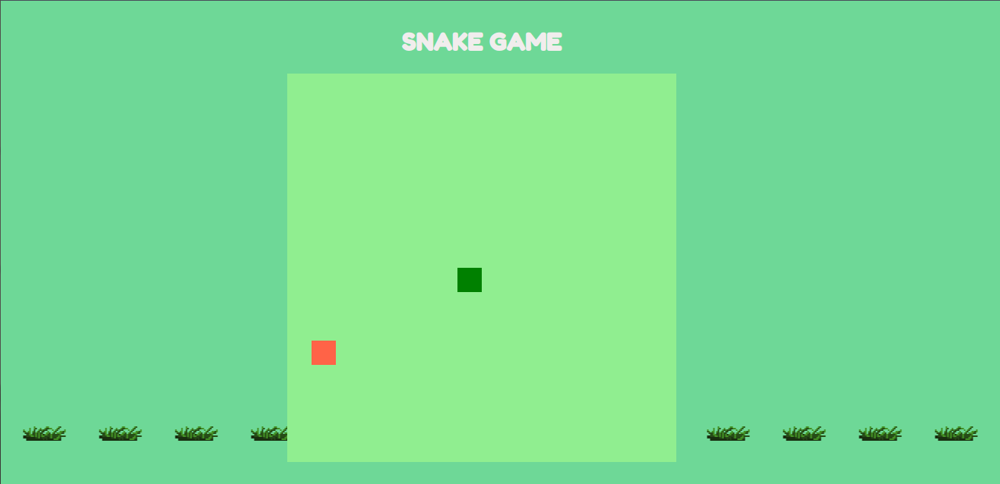

# :snake: snake-game
Jogo da cobrinha desenvolvido usando JavaScript, HTML e CSS.

<h1 align="center">
    
</h1>

Este projeto foi criado durante o curso "Recriando o jogo da cobrinha com JavaScript" promovido na plataforma da DIO.

<p align="center">
  <a href="#-tecnologias">Tecnologias</a>&nbsp;&nbsp;&nbsp;|&nbsp;&nbsp;&nbsp;
  <a href="#computer-instalação">Instalação</a>&nbsp;&nbsp;&nbsp;|&nbsp;&nbsp;&nbsp;
  <a href="#memo-licença">Licença</a>
</p>

<br>

## 🚀 Tecnologias

Esse projeto foi desenvolvido com as seguintes tecnologias:

- [HTML](https://developer.mozilla.org/pt-BR/docs/Web/HTML)
- [CSS](https://developer.mozilla.org/pt-BR/docs/Web/CSS)
- [JavaScript](https://developer.mozilla.org/pt-BR/docs/Web/JavaScript)


## :computer: Instalação

Para iniciar, efetue o clone do projeto do GitHub em um diretório de sua preferência:

```shell
cd "diretorio de sua preferencia"
git clone https://github.com/gustavofbc/snake-game.git
```

Em seguida, instale as dependências do projeto:

```shell
npm install
```

Para verificar o projeto funcionando, digite o comando:

```shell
yarn start
```
<b>OBS:</b> caso não abra uma guia em seu navegador, verifique o link [http://localhost:3000](http://localhost:3000)

e voalá! :tada:

## :memo: Licença

Esse projeto está sob a licença MIT. Veja o arquivo [LICENSE](LICENSE.md) para mais detalhes.
